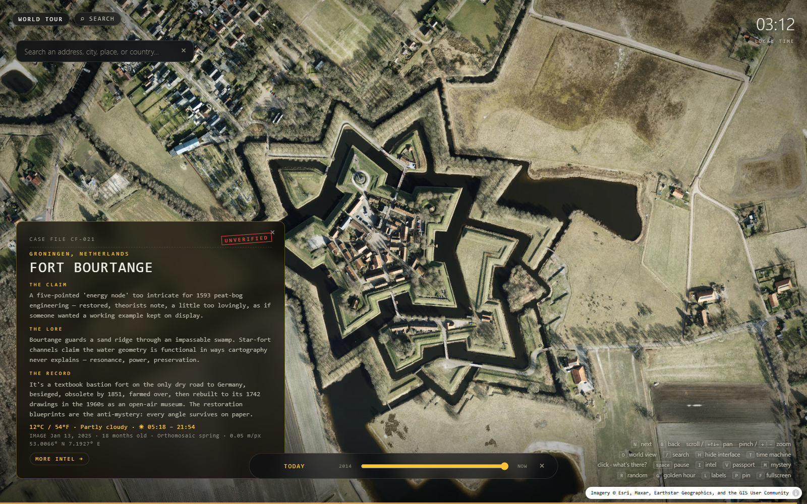
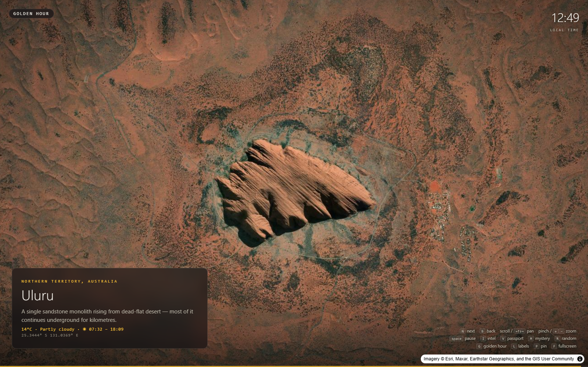

# DRIFT — an ambient atlas

**A screensaver that wanders the Earth.** Satellite imagery drifts from the Grand Canyon to Area 51 to places you've never heard of — with live weather, declassified-style dossiers on the world's mysteries, a twelve-year imagery time machine, and the name of the exact satellite that photographed whatever you're looking at.

**▶ Try it right now (nothing to install):** https://darcy0408.github.io/drift-screensaver/

## What it does

- **World tour** — drifts cinematically between 76 curated places: natural wonders, human marks, and 41 **mystery case files** (star forts, Tartaria lore, Area 51, phantom islands, megaliths…) each presenting *the claim, the lore, and the official story* side by side.
- **Click anywhere** — drops a marker and tells you what's there: streets, stadiums, beaches, landmarks (Wikipedia-aware, so it says "SoFi Stadium," not "footpath").
- **Search anything** — an address, a city, a country… or **paste a Google Maps URL / raw coordinates** to jump to a spot you found elsewhere and compare it against independent Esri imagery.
- **Time machine (`T`)** — scrub through Esri's Wayback archive to 2014. The slider only stops where *your view actually changed*, and each stop names the capture date, satellite, and provider.
- **Imagery vintage** — every card shows when the current photo was taken, how old it is, which satellite took it, and its resolution.
- **Live conditions** — temperature (°C/°F), sky, and daylight window at every stop, via Open-Meteo.
- **Golden hour mode (`G`)** — tours only places where the sun is currently rising or setting. **Deep field (`R`)** — random points on Earth. **Mystery files (`M`)** — case files only.
- **Poles (`P`)** — the map (like every web map) stops at 85° — so `P` opens NASA's daily polar-stereographic pass of the North pole; press again for the South, again to close.
- **Passport (`K`/`V`)** — pin places you love and fly back to them.
- **Share (`COPY LINK`)** — every view has a URL that opens exactly there for anyone.

## Controls

| Key | Action | Key | Action |
|---|---|---|---|
| `N` / `B` | next / previous place | `T` | time machine |
| click | what's there? | `/` | search |
| scroll / arrows / WASD | pan | `O` | world view and back |
| pinch / `+` `−` | zoom | `H` | hide the interface |
| `Space` | pause / resume tour | `I` | area intel panel |
| `M` `R` `G` | mystery / random / golden hour | `K` / `V` | pin / passport |
| `P` | view the poles (N → S → close) | `F` | fullscreen |
| `L` | place-name labels | `Esc` | close panel, then exit |

## Install as a Windows screensaver

1. Download this repo (green **Code** button → **Download ZIP**) and extract it — keep the `dist` folder together.
2. Right-click `dist\DriftSaver.scr` → **Install**. (Windows may warn about an unsigned app: *More info → Run anyway*.)
3. Set your idle time, click **Settings…** to pick a default tour mode, and uncheck *"On resume, display logon screen."*

Unlike a normal screensaver, keys and mouse **interact** — only `Esc` exits. Requires Windows 11 (or 10 with the WebView2 runtime) and an internet connection. Full details in [`dist/README.txt`](dist/README.txt).

## Found something? Submit it

Spotted an oddity, a gorgeous place, or an imagery inconsistency (something that looks different on Google Maps than here)? [**Submit a spot**](../../issues/new?template=submit-spot.yml) — good ones become part of the atlas, and mysteries get a full case file. There's also a submit link inside the app's MORE INTEL panel, prefilled with the coordinates you're looking at.

## Under the hood

A single static web page (no build step, no API keys, no accounts): [MapLibre GL](https://maplibre.org/) over [Esri World Imagery](https://www.arcgis.com/home/item.html?id=10df2279f9684e4a9f6a7f08febac2a9), with [Esri Wayback](https://livingatlas.arcgis.com/wayback/) for history, [OpenStreetMap/Nominatim](https://nominatim.org/) for geocoding, [Wikipedia](https://www.wikipedia.org/) & [Wikidata](https://www.wikidata.org/) for knowledge, [Open-Meteo](https://open-meteo.com/) for weather, and [CARTO](https://carto.com/) label tiles. The Windows screensaver is a small C# WebView2 host (`wrapper/Program.cs`) compiled with the `csc.exe` that ships inside Windows — rebuild command in [`SESSION_NOTES.md`](SESSION_NOTES.md).

## The ethos

Every case file opens the same way: three exhibits, side by side — **the claim, the lore, and the official story**. Then it hands you the instruments to check that official story yourself: the time machine (did the imagery change when they said it did?), the imagery's provenance (who photographed it, when, at what resolution?), cross-provider comparison (does Google show the same thing?), and live NASA polar imagery (see the poles the map projection can't draw). Where the official story is incomplete, the file says so. Where the official story *was* the deception — Great Zimbabwe's censored archaeology, the Bennewitz disinformation campaign — the file says that too.

Log what you find. Check it against the official story. Bring receipts. That's the whole religion.

Imagery © Esri, Maxar, Earthstar Geographics, and the GIS User Community.
